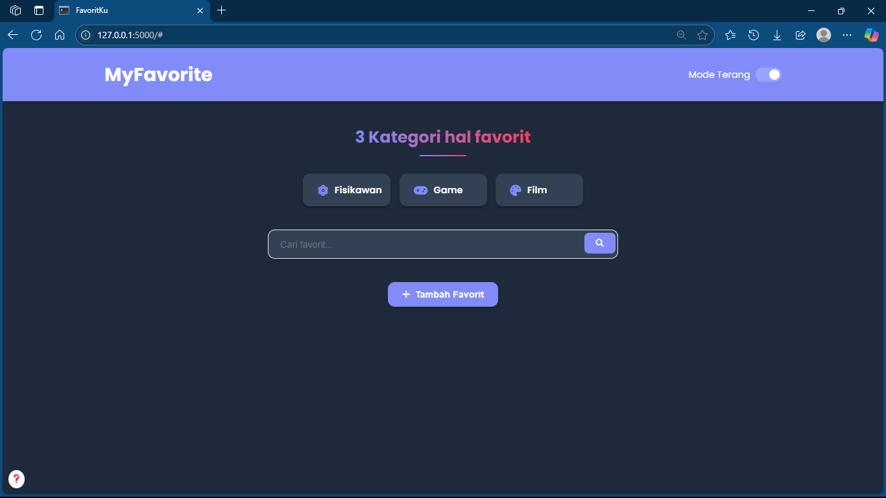
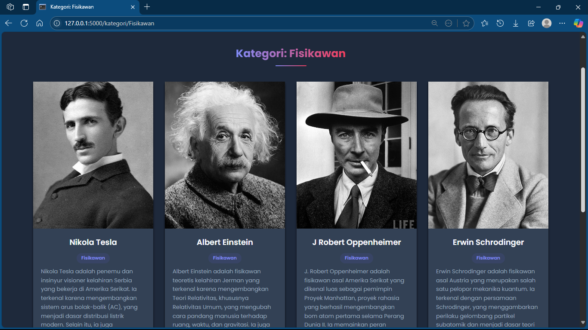

# 🎉 MyFavorite — Aplikasi Daftar Favorit dengan OOP Python + Flask

MyFavorite adalah aplikasi berbasis web yang dibuat menggunakan Python (Flask) dan menerapkan konsep Object-Oriented Programming (OOP) untuk mengelola dan menampilkan daftar favorit pengguna dalam tiga kategori utama: Fisikawan, Game, dan Film.


## ✨ Fitur Utama

- ✅ Tambah item favorit lengkap dengan deskripsi dan gambar
- 🔍 Pencarian favorit berdasarkan nama
- 📂 Filter berdasarkan kategori (fisikawan, game, film)
- 🌗 Dukungan mode gelap yang responsif
- 💾 Penyimpanan data lokal menggunakan file JSON
- 📸 Upload dan tampilkan gambar favorit
- 💻 Desain UI modern dengan HTML + CSS


## 🧠 Konsep OOP yang Digunakan

- *Encapsulation*: Setiap item favorit dibungkus dalam class Favorit.
- *Inheritance*: Class Fisikawan, Game, dan Film mewarisi dari Favorit.
- *Polymorphism*: Method get_info() dapat diubah di tiap class turunan sesuai konteks.


## Cara Menjalankan
```
git clone https://github.com/dbcoopert/TUGAS-UAS-PBO-S4.git
cd TUGAS-UAS-PBO-S4
pip install flask
python main.py
```


## Screenshot Aplikasi





## 👨‍💻 Teknologi yang Digunakan

- Python 3
- Flask
- HTML5 + CSS3
- JSON untuk penyimpanan
- Werkzeug untuk upload gambar


## 📋 Lisensi

Proyek ini dibuat untuk pembelajaran dan UAS kuliah. Bebas digunakan dan dimodifikasi untuk keperluan edukasi.

## Kontributor

- Asep Mardianto

## Kontak
- Email: mardiantoasep13@gmail.com

## DEMO
- [YouTube](https://youtu.be/m6HrQovTKU4?feature=shared)
